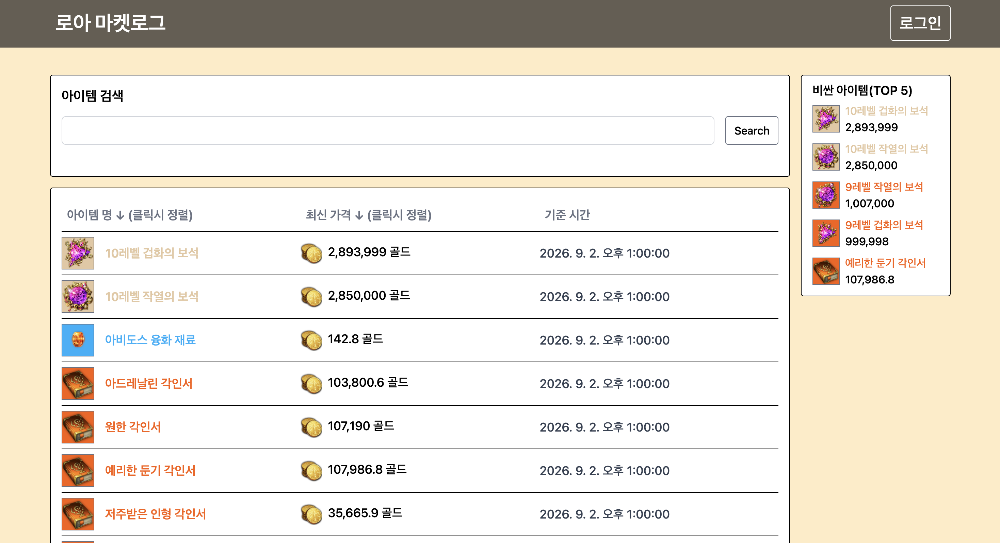

# lostark market log

## 배포 링크

- [https://loa-market-log.akdfid.kr](https://loa-market-log.akdfid.kr)
  - 첫 페이지 링크
- [https://loa-market-log.akdfid.kr/apidocs](https://loa-market-log.akdfid.kr/apidocs)
  - api명세서 링크

## Tech Stack

  

  

  

  

  

  

  

  

  

  

  

## 로스트아크 마켓 로그

- Lostark Open API를 활용하여 아이템들의 가격변동 추이를 확인하는 사이트 개발

## 화면 미리보기

## 프로젝트 인원

- 1명

## 주요 역할

### Full-stack Development

- 시스템 아키텍처 설계, 백엔드 API 서버 구축
- 프론트엔드 UI/UX 구현

## 프로젝트 목적

- 인프라 설계: 최초 AWS(S3/RDS)로 배포하여 서버 부하 분산 및 데이터 관리 효율화를 목표로함
  - 이후 비용 문제로 OCI로 인프라 전체를 이전, 관리형 서비스(RDS/S3) 없이 자체 서버에 MySQL/MongoDB를 직접 구성하고 정적 파일은 로컬 디스크에 저장하도록 재설계
- 핵심 기능 구현: NestJS의 생명주기(Guard, Filter 등)를 활용한 체계적인 예외 처리 및 백그라운드 태스크 관리
- 인증 로직 고도화: JWT 기반 인증 시스템 구축을 통해 프론트엔드와 백엔드 간의 안전한 데이터 교환 흐름 이해

## 주요 구현 및 담당 업무

### 보안 및 인증 시스템 설계

- JWT(JSON Web Token) 도입: Stateless한 인증 구조를 설계하여 서버 확장성을 확보하고, 토큰 기반 인증으로 클라이언트-서버 간 보안 통신을 구현했습니다.
- NestJS Guard 활용: 인가(Authorization) 로직을 미들웨어 계층에서 처리하여, 비정상적인 접근으로부터 리소스를 보호하고 코드의 재사용성을 높였습니다.

### 시스템 자동화 및 안정화

- Task Scheduling 기반 자동화: NestJS의 Cron 기능을 활용해 주기적인 데이터 수집 및 배치 프로세스를 자동화하여 운영 효율을 개선했습니다.
- Exception Filter를 통한 예외 공통화: 전역 예외 처리기(Global Exception Filter)를 구현하여 에러 응답 규격을 통일하고, 런타임 에러에도 서비스 연속성이 유지되는 안정적인 시스템을 구축했습니다.

### 개발 생산성 및 인프라 최적화

- Swagger(OpenAPI) 문서화: API 명세와 데이터 타입을 자동화하여 프론트엔드와의 협업 효율을 높이고, 타입 불일치로 인한 런타임 오류를 사전에 방지했습니다.
- 클라우드 인프라 마이그레이션: AWS(EC2/RDS/S3) 기반으로 운영하다 비용 효율화를 위해 OCI로 전체 인프라를 이전했습니다. 관리형 서비스 없이 자체 서버에서 DB와 정적 파일을 직접 관리하도록 구조를 재설계하고, 방화벽/인증 등 서버 보안 설정을 처음부터 직접 구성했습니다.

## 기술 역량

### Backend Development

- NestJS &amp; TypeScript: 모듈형 아키텍처를 이해하고, 타입 안정성을 확보한 견고한 서버 로직 구현
- TypeORM: Data Mapper 패턴을 활용한 효율적인 DB 스키마 설계 및 데이터 관리
- JWT Authentication: 토큰 기반 인증/인가 시스템 구축 및 보안 흐름 이해

### Frontend Development

- React: 컴포넌트 기반 개발을 통한 재사용성 극대화 및 사용자 경험(UX) 중심 UI 구현
- TailwindCSS: 유틸리티 우선(Utility-first) 방식의 스타일링으로 신속한 UI 프로토타이핑 및 일관된 디자인 시스템 적용

### Infrastructure &amp; DevOps

- OCI(Oracle Cloud Infrastructure): AWS Free Tier 종료에 따른 비용 부담으로 인프라를 이전, 자체 서버에서 MySQL/MongoDB/Nginx를 직접 구성 및 운영
- 클라우드 마이그레이션 경험: AWS(EC2, RDS, S3) 기반 운영 경험을 바탕으로 관리형 서비스 없이 자체 인프라로 전환, 이 과정에서 서버 보안(방화벽, 인증)과 배포 파이프라인을 직접 구축
- GitHub Actions CI/CD: main 브랜치 push 시 빌드, 테스트, 서버 배포(pm2 재시작 포함)까지 자동화한 파이프라인 구축
- Swagger: API 명세 자동화 및 프론트엔드-백엔드 간 원활한 협업 프로세스 구축

## 해당 프로젝트 노션 페이지 링크

- [https://www.notion.so/Lostark-Market-Log-1de59c7e40ad80509501c9d6d5adfdf3?pvs=4](https://www.notion.so/Lostark-Market-Log-1de59c7e40ad80509501c9d6d5adfdf3?pvs=4)

